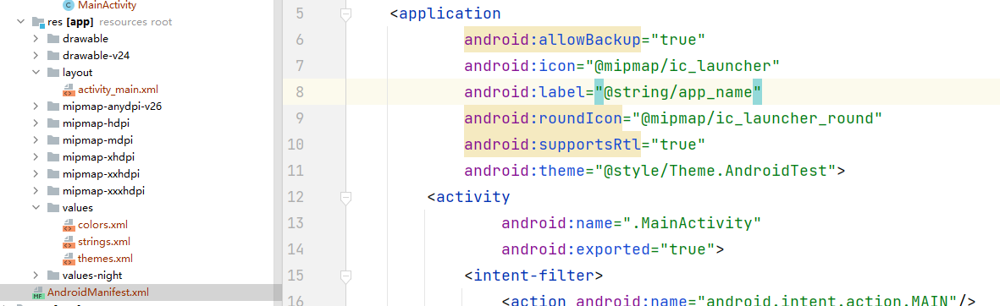

### Android 简单使用方法

#### 一、res资源库识记



（1）idea和eclipse对比，project和module是有不同含义的。

| idea    | eclipse                                   |
| ------- | ----------------------------------------- |
| project | workspace                                 |
| module  | project                                   |
| module  | workspace相当于一个空间，放着相关配置文件 |

如果我在Android项目中新建一个Module（Android项目），在项目中的Settings.gralde会自动加入一个模块：

```json
dependencyResolutionManagement {
    repositoriesMode.set(RepositoriesMode.FAIL_ON_PROJECT_REPOS)
    repositories {
        google()
        mavenCentral()
        jcenter() // Warning: this repository is going to shut down soon
    }
}
rootProject.name = "AndroidTest"
include ':app'
include ':secondapplication' //自动加入的

```


首先这里搞清楚res目录具体是放什么的，如表格所示：

| drawable | 图片资源               |
| -------- | ---------------------- |
| mipmap   | 应用图标               |
| values   | 颜色、主题、字符串数值 |
| layout   | 控件                   |

1. 问：如果只有一张图片，放在drawable哪里？

   答：放在drawable-xxhdpi文件夹。

2. 问：怎么访问value资源，包括修改图标，改标题等等？

   答：在AndroidMainfest.xml可以改标题。另外，**两种方法**可以获取values目录资源：

   1. 在MainActivity类，OnCreate方法：调用 **R.string.app_name** 

      R.替换的资源目录.xx可以获取想要的资源文件

      | R.string.xx   | 字符串 |
      | ------------- | ------ |
      | R.mipmap.xx   | icon   |
      | R.layout.xx   | layout |
      | R.drawable.xx | 图片   |

      

   2. 在xml中，通过@目录/资源变量名字 例如： @string/app_name

3. 

#### 二、认识Gradle

gradle是一个项目构建工具，类似于Maven，使用Google自己的语言。

在idea中要设置gradle环境目录，进入Settings->Build, Execution,deployment->build tool->gradle

主要看项目的build.gradle配置文件：

```json
plugins {
    id 'com.android.application'
}

android {
    compileSdk 33 //编译android SDK版本

    defaultConfig {
        applicationId "com.example.androidtest" //应用包名
        minSdk 24
        targetSdk 33
        versionCode 1
        versionName "1.0"
        testInstrumentationRunner "androidx.test.runner.AndroidJUnitRunner" //单元测试
    }

    buildTypes {
        release {
            minifyEnabled false
            proguardFiles getDefaultProguardFile('proguard-android-optimize.txt'), 'proguard-rules.pro'
        }
    }
    compileOptions {
        sourceCompatibility JavaVersion.VERSION_1_8
        targetCompatibility JavaVersion.VERSION_1_8
    }
}
dependencies {
    implementation 'androidx.appcompat:appcompat:1.2.0'
    implementation 'com.google.android.material:material:1.3.0'
    implementation 'androidx.constraintlayout:constraintlayout:2.0.4'
    testImplementation 'junit:junit:4.+'
    androidTestImplementation 'androidx.test.ext:junit:1.1.2'
    androidTestImplementation 'androidx.test.espresso:espresso-core:3.3.0'
}
```


#### 三、AndroidManifest.xml

AndroidManifest.xml 是一个注册文件，app加载时候读取里面的配置内容，启动哪个Activity、调用服务等。

##### 1.**Activity**

一个Activity 对应一个View，那么如何加载res/layout的一个布局控件？

(1)新建一个Activity，在AndroidManifest.xml会**自动注册**，类似的代码结构是

```xml
    <activity
                android:name=".MainActivity"
                android:exported="true">
            <intent-filter>
                <action android:name="android.intent.action.MAIN"/>
                <category android:name="android.intent.category.LAUNCHER"/>
            </intent-filter>
        </activity>
```

##### 2.Service

服务

##### 3.receiver

接收器

##### 4.provider


Activity当中有一个加载layout的方法：

**setContentView(R.layout.activity_main)**