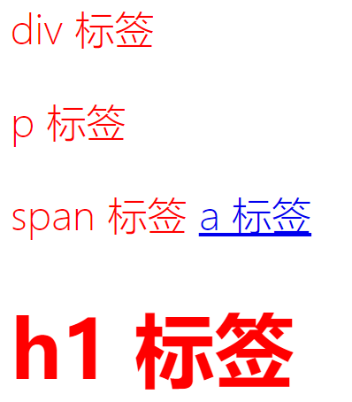
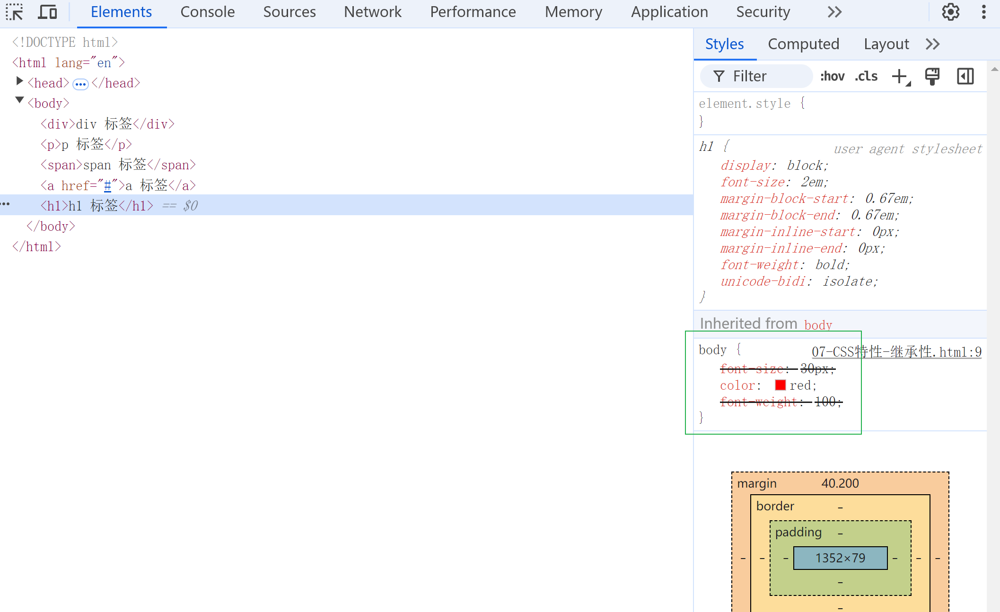
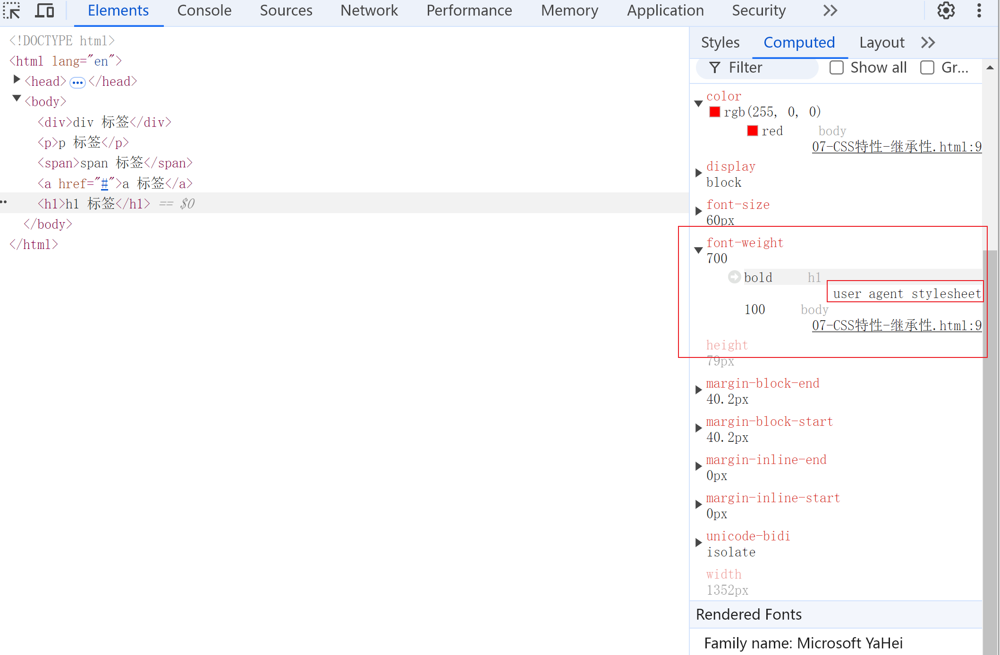
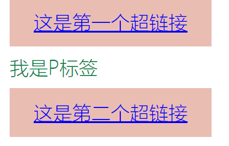
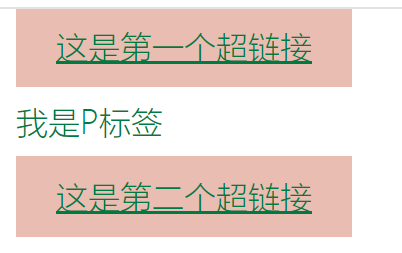
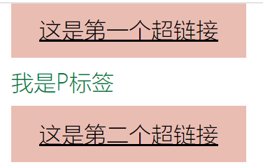
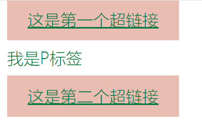

# CSS特性

CSS具有三个特性，在了解之前，可以看这段代码：

😺**div里面的文字最终会是什么颜色？**

CSS：

```css
.text1{
color:red;
}
#myText{
color:green;
}
div{
color:blue;
}
```

html:

```html
<div class="text1" id="myText" >
    你好吗？
</div>
```

这三个CSS样式都是指向div一个标签，它最终显示的文字颜色是？**是绿色**。因为应用了CSS的**优先级**⁉。等看完整个内容，再回来这里吧。

------


## 1.继承性（inherit）

### 📝简介

**子标签可以继承父标签的同名CSS属性**，例如font文字CSS样式、color这些，但不是所有CSS属性都可以继承，像 width、margin、padding 和 border 不会被继承，[去看详情](https://web.dev/learn/css/inheritance?hl=zh-cn)。

试想一下，如果 **border 可以被继承**，每个列表和列表项都会获得一个边框——可能就不是我们想要的结果！我们通常可以通过常识来判断哪些属性属于默认继承。看例子：

**CSS**:

``` css
body {
font-size: 30px;
color: red;
font-weight: 100;
}
```

**html:**

```html
<div>div 标签</div>
<p>p 标签</p>
<span>span 标签</span>
<a href="#">a 标签</a>
<h1>h1 标签</h1>
```

❗输出效果：

1. div、p、span、h1标签的文字都会是红色，a标签不是红色
2. div、p、span、a标签字号都是30px和字体不是加粗，h1标签字体是60px（默认）和加粗。



### 📝user agent style sheet 用户代理样式表

⁉为什么部分标签不会继承全部样式？

在浏览器中，存在user agent style sheet（用户代理样式表、**即浏览器默认样式**，**注意不是标签自己的默认值**），某些标签例如a标签的color属性，就有浏览器默认样式，color是蓝色。

如果标签存在user agent style sheet对应样式，则不继承父标签样式。

打开DevTool，点击其中一个标签，以H1标签为例，留意右边的Styles，画删除线的样式font-size、font-weight是不能被继承。为什么？



再点击**Computed**，**font-weight**应用的是**user agent stylesheet**的**bold**属性值，不是body标签的font-weight：100。font-size也是，可以对比一下。



所以，如果有user agent stylesheet或浏览器预先设定的样式，就会先被继承，如果没有就继承我们写的样式。

或者使用**控制继承**，来达到继承的目的。

### 📝控制继承 

作用：**让子标签的CSS属性选择是否继承父标签的同名CSS属性值**，具体参考：

[链接]: https://developer.mozilla.org/zh-CN/docs/Learn/CSS/Building_blocks/Cascade_and_inheritance#理解继承

属性值：

1.**inherit**：继承父标签的属性。

2.**initial**：沿用CSS属性原有的默认值，部分CSS属性没有默认值。

3.**unset**：3.unset：设置自然值，要么继承父标签的属性（inherit）；如果没有父标签没有设置相关的属性，就沿用CSS默认值（initial）。

先来看：

CSS:

``` css
main{
    color: #007a43;
    font-weight: 100;
}
a { 
    /* a标签、设置背景颜色 */
    padding: 10px 20px;
    background: #eabdb3;
    text-align: center; 
    /* a标签验证inheri\initial\unset */

}
```

html：

```html
<main>
    <a href="#">这是第一个超链接</a>
    <article>
        <p>我是P标签</p>
        <a href="#">这是第二个超链接</a>
    </article>
</main>
```

a标签是不会继承main标签的color属性，会沿用浏览器预先设定的样式，蓝色字、下划线



#### 1.**inherit** 

继承父标签

设置a标签，**color:inherit**，a标签color与父标签main标签color颜色一致：



#### **2.initial**

设置默认值

**设置a标签，**color:initial，a标签color设置为默认值，没有颜色，a标签默认值没有颜色。



#### 3.unset

自然值，要么inherit，继承父元素的，要么initial，用属性默认值的。

这里color:unset，显然是inherit。



------


## 2.优先级


|                                |                             |            |      |
| :----------------------------- | :-------------------------- | :--------- | :--- |
| 选择器的类型                   | 实例                        | 选择器权重 |      |
| !important                     | div{ color:red!important; } | 无穷大     |      |
| 行内样式（style 属性中样式）   | style='color:red;'          | 1000       |      |
| id 选择器                      | #id                         | 100        |      |
| class、属性选择器              | .box、:hover、[type='text'] | 10         |      |
| 标签选择器                     | div                         | 1          |      |
| 通配符、子选择器、相邻选择器等 | *、> 、+、~                 | 0000       |      |
| 继承的样式                     |                             | 0000       |      |

## 


|                                | 内联样式 | ID   | class | 标签 |
| ------------------------------ | -------- | ---- | ----- | ---- |
| 权重（数值越大，优先级越高）： | 1000     | 100  | 10    | 1    |
| 例子：                         |          |      |       |      |
| #mySpan p .                    |          |      |       |      |


## !important

加!important，不受CSS优先级影响，强制应用样式：

``` 
p{
  color:#f00 !important;
}
```


## 层叠

按照以下顺序，样式会被覆盖：

1.CSS引入样式，是内联，还是外部link引入

2.样式直接加!important


## 导入样式顺序：

内联样式(style=)>内部样式（<style>）>外部样式(link)>浏览器默认