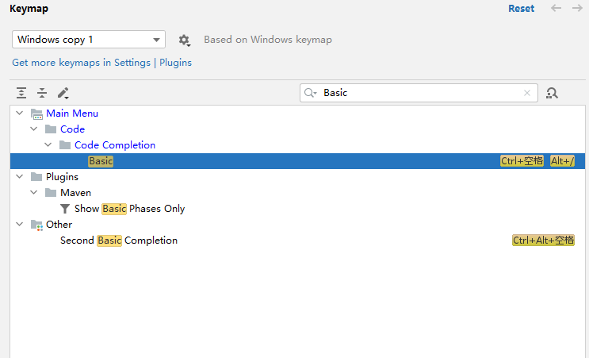

### 修改IDEA快捷键

2022-8-25

#### 修改代码提示快捷键 

默认代码提示快捷键是：Ctrl+ 空格，与Windows系统输入法有冲突，现在要改成：Alt + /

位置在：File > Settings > Keymap

由于Alt + /被Cyclic Expand Word占用，需要先修改，搜索：Cyclic Expand Word，右键移除快捷键ShortCut。

搜索：Basic，右键修改快捷键ShortCut，完成。

#### 显示或重写方法快捷键

1.Override Methods：Ctrl + O

2.Implement Methods： Ctrl + I

#### 删除代码

删除一行代码： Ctrl + Y

