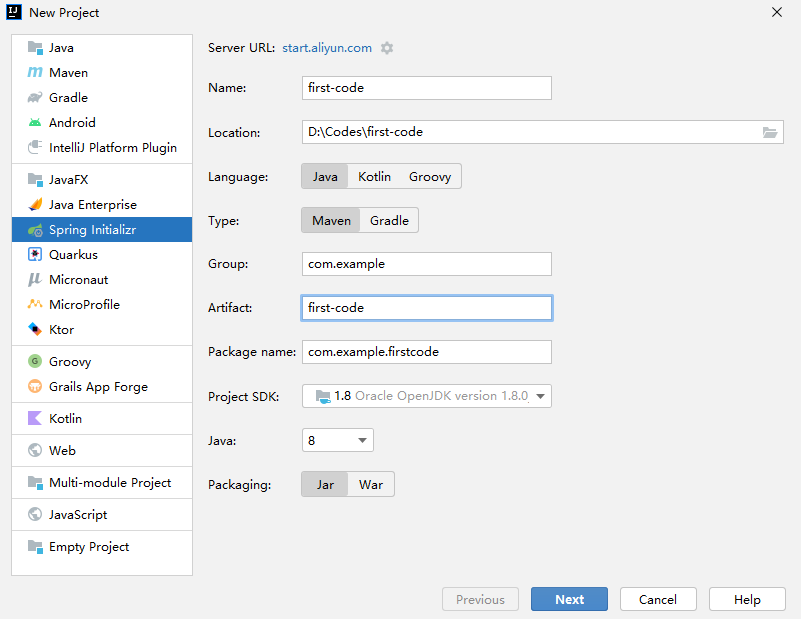

### 构建Spring Boot项目

#### 构建项目步骤

1. IDEA 建立项目

   在IDEA 2021.2构建Spring Boot项目，选择菜单栏：File > New > Project 。

   这里说明一些填空项的规则：

   - **Location**：选择你的项目要放在哪个文件夹，最终在IDEA里显示的项目名称以目录名字为准。例如，目录是**ABC**，那么在IDEA就会显示项目**ABC**。

   - **Group**：组别，一般以com.xxx.xxx命名。

   - **Artifact**：这里是输入项目名称，如果你没有选择过**Location**，这里输入了相关项目名称，**Location**、**Name**、**Package** **name** 都会跟随**Artifact** 改变。

   还有，可能会提示https://spring.io连接不了的错误，选择**Server** **URL，** 修改为：https://start.aliyun.com 

   

   

2.  点击Next，在Dependecies那里，选择WEB，勾选Spring Web 点击Finish，完成构建。